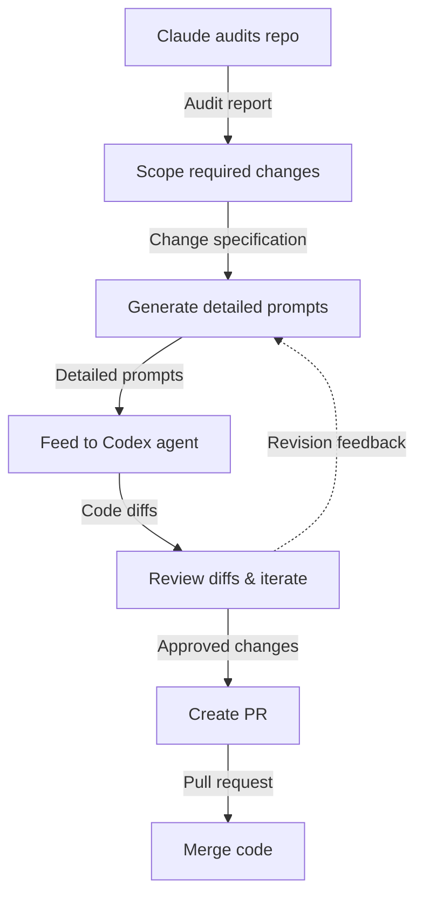

Four months ago, I completed the [_WAI0.1x: Introduction to Web Accessibility_ certification](https://www.edx.org/learn/web-accessibility/the-world-wide-web-consortium-w3c-introduction-to-web-accessibility). What started as professional development quickly became a fundamental shift in how I approach web development. Recently, whilst building a bilingual band website for a client at [Tandem Creative Dev](https://runintandem.com/), I discovered the gap between accessibility theory and modern framework implementation, and why that gap matters more than I initially realised.

Hold tight, this is a long one, so I've included a **tl;dr** below if you're just here for accessibility insights in Next.js and Tailwind.

---

## TL;DR: Accessibility in Next.js + Tailwind

**Dynamic language switching:**

```tsx
useEffect(() => {
  document.documentElement.lang = isFrench ? "fr" : "en";
}, [isFrench, isLoading]);
```

**Essential Tailwind accessibility classes:**

- `sr-only`: Screen reader only content
- `focus-visible:ring-2`: Keyboard focus indicators
- `motion-reduce:hidden/block`: Respect motion preferences
- `focus:outline-none focus:ring-2`: Custom focus styling

**Form validation (browser-first approach):**

```tsx
if (formRef.current && !formRef.current.checkValidity()) {
  formRef.current.reportValidity();
  return;
}
```

**Live regions for dynamic content:**

```tsx
<div aria-live="polite" className="sr-only">
  Image {currentIndex + 1} of {images.length}
</div>
```

**Focus management with focus-trap-react:**

```tsx
<FocusTrap
  active={isMenuOpen}
  focusTrapOptions={{
    returnFocusOnDeactivate: true,
    setReturnFocus: menuButtonRef.current,
  }}
>
```

**Component patterns:**

- Use proper semantic HTML (`nav`, `main`, `section`, `article`, `ul`)
- Add `aria-label` for context
- Include `aria-describedby` for help text
- Group related form elements with `role="group"`

**Motion preferences:**

```tsx
<video className="motion-reduce:hidden" />
<Image className="motion-reduce:block hidden" />
```

**Key insight:** Build accessible patterns into reusable components once, then scale across your application. Browser validation + accessibility enhancements often beats aggressive custom validation for simple forms.

---

## From vanilla HTML to modern frameworks

The WAI course teaches accessibility principles using vanilla HTML and CSS, which provides excellent foundations. However, translating these concepts to [Next.js 15](https://nextjs.org/) with React components and Tailwind CSS revealed interesting challenges. The principles remain constant, but the implementation requires thoughtful adaptation.

[Tailwind CSS](https://tailwindcss.com/), for those unfamiliar, is a utility-first CSS framework. Instead of writing custom CSS classes, you apply pre-built utility classes directly in your markup. For example, `focus:ring-2` `focus:ring-blue-500` generates CSS that applies a 2px ring with blue colouring when an element receives focus—perfect for accessibility requirements.

Building the [Clark's Bowling Club website](https://clarksbowlingclub.com/) forced me to confront a crucial question: how do accessibility fundamentals translate when you're working with utility-first CSS and component-based architecture?

## Dynamic language switching beyond visual toggles

The bilingual aspect of the site exposed a critical gap in my understanding. Visual language toggles aren't enough and screen readers need the HTML `lang` attribute to pronounce content correctly. Without proper language switching, French content gets butchered with English phonetics, creating a jarring experience for users relying on audio feedback.

The solution was surprisingly simple:

```tsx
useEffect(() => {
  if (!isLoading) {
    document.documentElement.lang = isFrench ? "fr" : "en";
  }
}, [isFrench, isLoading]);
```

This programmatic approach directly inside the language [context](https://react.dev/reference/react/createContext) ensures that when users switch languages, screen readers immediately adjust pronunciation. The visual toggle uses Tailwind's conditional classes:

```tsx
<span
  className={clsx(
    "mr-3 text-2xl font-medium font-blanch",
    !isFrench ? "text-clarks-orange" : ""
  )}
>
  EN
</span>
```

## Form validation philosophy

The WAI course presents form validation as straightforward: provide clear error messages and ensure they're programmatically associated with inputs. Reality proved more nuanced when I faced choosing between technically perfect custom validation and user-friendly browser defaults.
Aggressive custom validation that meets accessibility requirements can feel invasive. Picture this: you start filling out a contact form, miss a required field, and suddenly your pristine webpage erupts with angry red text highlighting every single missing input. Technically it is accessible but for me it feels unpleasant to use.
[Browser-first validation](https://developer.mozilla.org/en-US/docs/Learn_web_development/Extensions/Forms/Form_validation) takes a gentler approach. Only the first unfilled input gets highlighted with a temporary, unobtrusive bubbles. For a simple contact form, this feels natural and respectful of the user's process. They're not being shouted at by the interface but instead being politely guided.
Of course, this approach has trade-offs. For longer forms where users need to scroll up and down, the aggressive approach might actually be more helpful, showing all issues at once rather than making users play whack-a-mole with validation errors.
For [this simple contact form](https://clarksbowlingclub.com/contact), I chose browser-first validation with accessibility enhancements:

```tsx
async function handleSubmit(e: FormEvent<HTMLFormElement>) {
  e.preventDefault();

  if (formRef.current && !formRef.current.checkValidity()) {
    formRef.current.reportValidity();
    return;
  }
}
```

This leverages familiar browser validation bubbles whilst adding enhanced context through proper form labelling:

```tsx
<form
  aria-labelledby="contact-form-heading"
  aria-describedby="contact-form-description"
>
  <h2 id="contact-form-heading" className="sr-only">
    Contact Form
  </h2>
  <p id="contact-form-description" className="sr-only">
    Fill out this form to send us a message. Required fields are marked.
  </p>
</form>
```

The `sr-only` tailwind class provides context for screen readers without visual clutter. Sometimes the most accessible solution is the one users already understand, enhanced thoughtfully rather than replaced entirely.

## Respecting motion preferences

One aspect I hadn't fully appreciated was the [`prefers-reduced-motion` media query](https://developer.mozilla.org/en-US/docs/Web/CSS/@media/prefers-reduced-motion). For users with vestibular disorders, unnecessary motion can cause genuine discomfort. Tailwind makes this consideration straightforward:

```tsx
<video
  className={`${backgroundClasses} motion-reduce:hidden brightness-50`}
  src="/videos/teaser.mp4"
  autoPlay
  loop
  muted={muted}
/>

<Image
  src="/images/home.png"
  alt=""
  fill
  className={`${backgroundClasses} motion-reduce:block hidden`}
/>
```

The `motion-reduce:hidden` and `motion-reduce:block` classes translate to proper CSS media queries. When a user has reduced motion enabled, the video becomes hidden whilst the static image displays.

## Live regions for dynamic content

Any content that updates without a page refresh needs proper [announcements through live regions](https://developer.mozilla.org/en-US/docs/Web/Accessibility/ARIA/Guides/Live_regions). This applies to carousels, filtered lists, and search results:

```tsx
<figure className="relative w-full h-96">
  <ul className="flex transition-transform duration-500">
    {images.map((image, index) => (
      <li key={index}>
        <Image
          src={image}
          alt={altTexts?.[index] || `Band image ${index + 1}`}
          className="w-full h-full object-cover"
        />
      </li>
    ))}
  </ul>

  <div aria-live="polite" className="sr-only">
    Image {currentIndex + 1} of {images.length}: {getCurrentImageDescription()}
  </div>
</figure>
```

The `aria-live="polite"` attribute ensures screen readers announce slide changes without interrupting other content. I applied this same pattern to music and lyrics filtering systems.

## Focus management that works

Mobile navigation required proper focus trapping using [focus-trap-react](https://github.com/focus-trap/focus-trap-react):

```tsx
<FocusTrap
  active={isMenuOpen}
  focusTrapOptions={{
    initialFocus: false,1
    escapeDeactivates: true,
    returnFocusOnDeactivate: true,
    allowOutsideClick: true,
    setReturnFocus: menuButtonRef.current,
  }}
>
  <header className="absolute top-0 left-0 w-full md:bg-black md:bg-opacity-10 md:text-white z-20">
    {/* Navigation content */}
  </header>
</FocusTrap>
```

The `returnFocusOnDeactivate` property ensures that when the menu closes, focus returns to the hamburger button, which is exactly what a keyboard user expects.

## Visual feedback with semantic meaning

Focus indicators needed to work across the entire colour palette whilst maintaining sufficient contrast:

```tsx
const baseClass =
  "text-center border border-white min-w-36 p-3 focus:ring-clarks-orange focus-visible:ring-2 focus:outline-none";
```

These Tailwind classes provide proper focus management:

- `focus:ring-clarks-orange` applies a custom colour ring when focused
- `focus-visible:ring-2` shows focus rings only for keyboard navigation
- `focus:outline-none` removes default browser outlines in favour of custom styling

## Component architecture for scalable accessibility

What I became most interested in was how accessibility improvements compounded through proper component architecture. Once I solved focus management for one menu or semantic structure for one list, these patterns scaled across the entire application.

Reusable semantic patterns emerged:

```tsx
<nav aria-label={`${contentType} category filters`}>
  <ul className="flex justify-between gap-3">
    {categories.map((category) => (
      <li key={category}>
        <FilterButton
          filter={category}
          isSelected={selectedCategory === category}
          onClick={() => handleCategoryChange(category)}
          aria-label={`Filter by ${category}`}
        />
      </li>
    ))}
  </ul>
</nav>
```

Enhanced form components with comprehensive accessibility support:

```tsx
<div role="group" aria-labelledby={`${id}-label`}>
  <label id={`${id}-label`} htmlFor={id}>
    {label}
    {required && (
      <>
        <span aria-hidden="true"> (required)</span>
        <span className="sr-only"> required</span>
      </>
    )}
  </label>
  {helpText && (
    <div id={`${id}-help`} className="text-sm text-gray-400">
      {helpText}
    </div>
  )}
  <input aria-describedby={helpText ? `${id}-help` : undefined} {...props} />
</div>
```

## The compound effect

These individual improvements created a compound effect. Proper semantic HTML made the site easier to test. Comprehensive focus management improved keyboard navigation for power users. Reduced motion support led to better performance on older devices.

The bilingual aspect revealed another insight aswell: good information architecture benefits everyone. Clear, logical structures that work for screen readers also work for users navigating in their second language.

## AI-assisted accessibility improvements

During implementation, I began documenting patterns and creating detailed audits of each component. This led to an unsurprising but critical discovery: AI can dramatically accelerate accessibility improvements when given proper structure and guidance.

I followed a similar process to those outlined in my previous blogposts, [AI-assisted development](https://www.maxitect.blog/posts/ai-in-the-loop-reflections-on-delivering-the-hula-workshops-at-founders-coders) and [AI-assisted pair-programming](https://www.maxitect.blog/posts/beyond-solo-ai-how-pair-programming-with-claude-code-transforms-team-development). I fed component-specific accessibility guidance to Claude, asking it to perform accessibility audits on very specific topics like semantic HTML usage, ARIA implementation, and focus management patterns. By keeping each audit focused on a single accessibility domain, the AI provided remarkably detailed and actionable feedback.

The workflow that emerged:

1. **Focused audits**: Audit one accessibility aspect at a time
2. **Structured guidance**: Provide framework-specific accessibility patterns
3. **Component-level analysis**: Audit individual components rather than entire applications
4. **Implementation suggestions**: Generate specific code improvements with clear explanations

This approach could become far more powerful with emerging AI development tools that can autonomously implement accessibility improvements across codebases.

## Enter codex: the next evolution

This approach became significantly more practical when I actually used [OpenAI's Codex agents](https://openai.com/index/introducing-codex/) to implement the accessibility improvements that I scoped together with Claude. Rather than manually applying dozens of ARIA labels and focus management patterns across components, Claude prepared long prompts to feed into the Codex agent the specific changes we'd scoped out and watched it systematically work through the repository.

The process was surprisingly effective. After Claude audited the codebase and we identified patterns like missing `aria-label` attributes on buttons and inconsistent focus management, Codex agents spun up containerised environments where it can write, lint, test, run and build the repo code to handle the repetitive implementation work. It read the project structure, applied semantic HTML improvements across components, and even generated pull requests with terminal logs showing the changes.

I was able to replicate this process across several of our other projects with remarkable speed. What emerged was a systematic workflow that turned accessibility auditing from a manual slog into something approaching automation:



**The workflow in practice:**

1. **Audit phase**: Claude reads through the codebase, identifying missing ARIA labels, improper semantic HTML, focus management gaps and so on
2. **Scoping session**: We discuss and prioritise the changes, breaking them into logical chunks (forms first, then navigation, then dynamic content)
3. **Prompt generation**: Claude creates detailed, actionable prompts for each chunk, specifying exactly what patterns to apply and where
4. **Implementation**: Codex agents work through the prompts systematically, and in parallel, applying changes across multiple files
5. **Review cycle**: I examine the diffs, catch any edge cases, and iterate with the agent on refinements
6. **Integration**: Codex generates clean pull requests with proper commit messages and documentation

And voila. What previously took days of careful manual implementation now happened in hours. Also, the consistency was better - no more forgetting to add `aria-label` to that one button buried in a component I hadn't touched in months.

The process felt like having a meticulous junior developer who never gets tired of repetitive tasks, combined with an experienced accessibility consultant who spots patterns you'd miss. Once the workflow was established, rolling it out across our other projects became straightforward.

## Bridging principles and practice

The WAI course provides essential foundations, but translating these principles to modern frameworks requires thoughtful adaptation. Tailwind CSS actually makes many accessibility patterns easier to implement through classes like `sr-only`, `focus-visible:ring-2`, and `motion-reduce:hidden`.

React's component model allows you to build reusable accessible patterns. Once you've solved focus management for one modal, you can apply the same solution across your entire application. The key is understanding the underlying accessibility principles well enough to adapt them to whatever tools you're using.

Accessibility isn't a destination—it's a practice. Each project teaches new lessons about how different users interact with interfaces. The WAI certification provided the foundation, but real learning happens when you're debugging why a screen reader stumbles over your custom dropdown or figuring out how to make a complex animation respect user motion preferences.

The investment pays dividends beyond compliance. You'll write clearer code, design more logical interfaces, and build experiences that truly work for everyone. Most importantly, you'll develop the mindset to spot accessibility opportunities early, when they're easiest and most cost-effective to implement. The systematic approach I developed using AI agents to scale these improvements across multiple projects suggests we're moving toward a future where accessibility becomes less of a manual checklist and more of an integrated, automated practice, but only if we understand the principles well enough to teach machines what good accessibility actually looks like.
